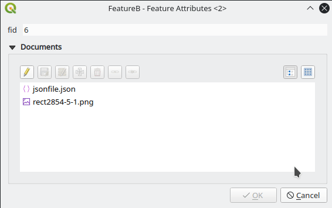

# Document Management System plugin for QGIS

## What
A document management plugin to help managing relations between a document table and one or more feature tables.

## Configuration

### Relations
The relation/s between the Document table and the Feature/s table/s must be configured by hand in the usual way in Project -> Properties -> Relations.
Please refer to the QGIS documentation for how to setup [relations](https://docs.qgis.org/testing/en/docs/user_manual/working_with_vector/attribute_table.html#vector-relations) or [polymorphic relations](https://docs.qgis.org/testing/en/docs/user_manual/working_with_vector/attribute_table.html#introducing-polymorphic-relations).

### Document side

#### Widget type
Set to *Document relation editor (Document side)*

#### Relation to features
* Normal one to many
  * Set cardinality to *Many to one relation*
  * Uncheck *Polymorphic relation*
* Normal many to many
  * Set cardinality to the final table
  * Uncheck *Polymorphic relation*
* Polymorphic
  * Set cardinality to *Many to one relation*
  * Check *Polymorphic relation*
  * Select the right polymorphic relation with the selection box

### Feature side

#### Widget type
Set to *Document relation editor (Feature side)*

#### Relation to documents
* Normal one to many
  * Set cardinality to *Many to one relation*
* Normal many to many
  * Set cardinality to the document table
  
#### Widget configuration

* **Documents default path:** An expression to the default path for documents. This is in most cases the same expression as for the attachment widget's default path in the documents table attribute form. For example `@project_folder || '/Documents'`
* **Documents path field name:** The name of the field containing the filename in the documents table.
* **Document author:** An expression for the author of the document.

## Usage

### Document side

### Feature side

