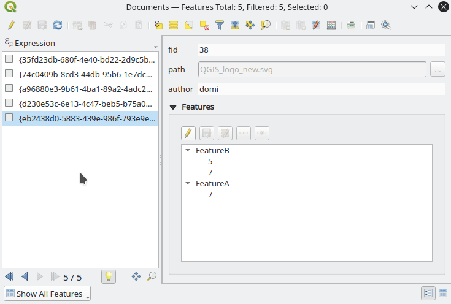

# Document Management System plugin for QGIS

## What
A document management plugin to help managing relations between a document table and one or more feature tables.

Two example project demonstrating the usage of the plugin with different configurations are provided:
[Demo project](demo_projects)

## Configuration

### Relations

Several relation scenarios are possible in a project involving a document table and in this documentation are referred this way:
- **Normal Many to One**: There is one document table and one feature table. The link is done with a foreign key field in the document table. Many documents can be linked with one feature. A document can be linked only with one feature. See the menu *Project->Properties->Relations* in the simple bees project [bee_farming_normal_many_to_one_relation.qgs](demo_projects/bee_farming_normal_many_to_one_relation.qgs).
- **Normal Many to Many**: There is one document table, one feature table and one join table. The link is done with an entry in the join table which have two foreign keys columns: one for the document and one for the feature. In this setup many documents can be linked to many features and the opposite.
- **Polymorphic Many to One**: There is one document table and multiple feature tables (i.e. with points, lines, polygons, ...). The link is done with a set of many to one relations called Polymorphic relation and they consists of two columns in the document table: the Id of the feature and a QGIS expression pointing to the referenced feature table (layer). A document can be linked only with one feature.
- **Polymorphic Many to Many**: There is one document table, multiple feature tables and a join table. The link is done with an entry in the join table which have two columns for the Id of the document and of the feature and a third column with a QGIS expression pointing to the referenced feature table. In this setup many documents can be linked to many features from one or multiple layers. See the menu *Project->Properties->Relations* in the polymorphic bees project [bee_farming_polymorphic_many_to_many_relation.qgs](demo_projects/bee_farming_polymorphic_many_to_many_relation.qgs).

The relation/s between the Document table and the Feature/s table/s must be configured by hand in the usual way in Project -> Properties -> Relations.
Please refer to the QGIS documentation for how to setup [relations](https://docs.qgis.org/testing/en/docs/user_manual/working_with_vector/attribute_table.html#vector-relations) or [polymorphic relations](https://docs.qgis.org/testing/en/docs/user_manual/working_with_vector/attribute_table.html#introducing-polymorphic-relations).

### Document side

#### Widget type
Set to *Document relation editor (Document side)*

#### Relation to features
- **Normal Many to Many**
  - Set cardinality to the final table
  - Uncheck *Polymorphic relation*
- **Polymorphic Many to Many**
  - Set cardinality to *Many to one relation*
  - Check *Polymorphic relation*
  - Select the right polymorphic relation with the selection box

---
**Note**:
For the Many to One configurations the relation editor widgets are not available. The usual relation reference widget can be used in this context.

---

### Feature side

#### Widget type
Set to *Document relation editor (Feature side)*

#### Relation to documents
- **One to many**: Set cardinality to *Many to one relation*
- **Many to many**: Set cardinality to the document table

---
**Note**:
There is no distinction for polymorphic relation as from the feature point of view this are normal foreign key relations

---

#### Widget configuration

- **Documents default path:** An expression to the default path for documents. This is in most cases the same expression as for the attachment widget's default path in the documents table attribute form. For example `@project_folder || '/Documents'`
- **Documents path field name:** The name of the field containing the filename in the documents table.

## Usage

### Document side

### Feature side

